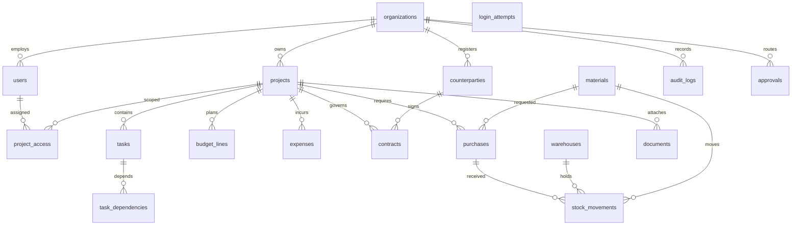

# Модель данных

## Миграции

Схема меняется только версионными миграциями Drizzle в `drizzle/` (`npm run db:generate` после правки `src/db/schema.ts`, ревью SQL, коммит). Применение — `npm run db:migrate` (или автоматически при старте контейнера: `scripts/migrate.ts`). `drizzle-kit push` не используется.

- Журнал применённых миграций — `drizzle.__drizzle_migrations`. Параллельный запуск нескольких экземпляров безопасен (advisory lock).
- **Baseline.** БД, созданная раньше через `push` (есть `public.organizations`, нет журнала), сначала сверяется со схемой `0000_baseline`: все таблицы и колонки должны существовать. Тогда `0000` помечается применённой без изменения данных, затем применяются остальные. При расхождении — остановка с перечнем недостающего; данные не трогаются, нужна ручная сверка.

| Миграция | Содержание |
|---|---|
| `0000_baseline` | Схема 0.1.0 без изменений |
| `0001_users_security` | `users.is_active`, `session_version`, `must_change_password`, `password_changed_at`; таблица `login_attempts (key PK, count, until)` |

Все PK — UUID, создаются в БД; внешние ключи указаны в `src/db/schema.ts`. Ключевые таблицы: organizations, users, project_access, projects, counterparties, contracts, tasks, task_dependencies, budget_lines, expenses, materials, warehouses, stock_movements, purchases, approvals, documents, notifications, audit_logs.

`users.email` уникален глобально; `(projects.organization_id,code)`, `(materials.organization_id,sku)` и `(project_access.user_id,project_id)` уникальны. Индексы: проекты по организации; задачи, бюджет, расходы и закупки по проекту; движения по паре материал/склад; аудит по организации/времени. FK требуют существования связанных сущностей. NOT NULL применяется к обязательным полям; nullable — ссылки на необязательные договор, работу, проект и др. `status`, `type` и `role` хранятся строками и валидируются API; для строгой защиты при прямом SQL следует добавить CHECK-ограничения в следующей миграции.

`stock_movements.quantity` всегда положителен, знак определяется видом операции. `purchases.received_quantity` показывает принятый объем. `budget_lines.amount` и `expenses.amount` не float. `tasks.parent_id` — иерархия WBS, а `task_dependencies` — связи задач (хранение реализовано, расчет графа нет).
