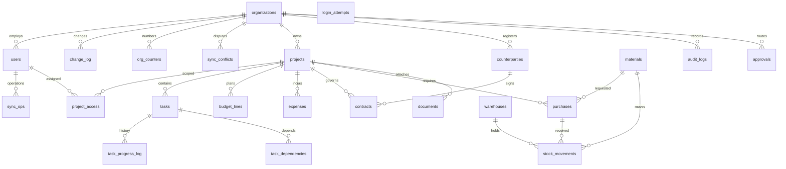

# Модель данных

## Миграции

Схема меняется только версионными миграциями Drizzle в `drizzle/` (`npm run db:generate` после правки `src/db/schema.ts`, ревью SQL, коммит). Применение — `npm run db:migrate` (или автоматически при старте контейнера: `scripts/migrate.ts`). `drizzle-kit push` не используется.

- Журнал применённых миграций — `drizzle.__drizzle_migrations`. Параллельный запуск нескольких экземпляров безопасен (advisory lock).
- **Baseline.** БД, созданная раньше через `push` (есть `public.organizations`, нет журнала), сначала сверяется со схемой `0000_baseline`: все таблицы и колонки должны существовать. Тогда `0000` помечается применённой без изменения данных, затем применяются остальные. При расхождении — остановка с перечнем недостающего; данные не трогаются, нужна ручная сверка.

| Миграция | Содержание |
|---|---|
| `0000_baseline` | Схема 0.1.0 без изменений |
| `0001_users_security` | `users.is_active`, `session_version`, `must_change_password`, `password_changed_at`; таблица `login_attempts (key PK, count, until)` |
| `0002_provenance_versions_changelog` | Происхождение фактов; `version`/`updated_at`; `task_progress_log`, `change_log`, `sync_ops`, `org_counters`; `tasks.progress_reported_at`, `purchases.local_ref`. Бэкфилл: `server_received_at = created_at`, `updated_at = created_at`, у старых фактов `origin='online'`, `device_created_at` = NULL (неизвестно) |
| `0003_devices` | `devices` (id, user_id, name, app_version, token_hash — только SHA-256, registered_at, last_sync_at, revoked_at) |
| `0004_offline_sync` | `sync_conflicts` (op_id уникален, организация, объект, kind `insufficient_stock` / `over_receipt`, команда и её вход, причина, status `open` / `resolved` / `discarded`, assigned_role, автор, устройство, время ввода, кто и когда решил, resolution, version); `users.blocked_at`, `users.unblocked_at` — последний интервал блокировки (для отказа `user_blocked`). Существующие строки не меняются. `sync_ops.status` дополнительно принимает `conflict` |

### Локальная база десктопа (0.4.0)
Та же схема (миграции `drizzle/`) — реплика. Плюс таблицы только клиента в **`drizzle-client/`** со своим журналом `drizzle.__drizzle_client_migrations` (на сервере их нет): `sync_state` (адрес сервера, устройство, пользователь, `last_seq`, выбранный и фактический офлайн-набор, признак повторной загрузки, статус для индикатора). Генерация: `npx drizzle-kit generate --config drizzle.client.config.ts`.

**0.5.0 (P4), `drizzle-client/0001_outbox`:**
- **`outbox`** — очередь операций, введённых на ноутбуке: `op_id` PK, `seq` (порядок ввода = порядок отправки), команда, вход, `device_created_at`, `status` `pending` → `sending` → `applied` | `rejected` | `conflict`, `entity_id` (id созданной строки), `depends_on uuid[]`, `error_code`/`error` (причина отказа), `conflict_id`, `attempts`, `hidden` (скрыта с экрана, но остаётся в экспорте), `sent_at`, `settled_at`.
- **`local_rows`** — какие строки реплики записала операция: `op_id` → (`entity`, `entity_id`, `before`). `before` — строка до изменения в формате pull (NULL — строку создала операция). По `local_rows` делается откат при отказе и ставятся пометки «не синхронизировано» / «спорно»; при pull `before` обновляется до последней серверной версии.
- Хранение: принятые операции — 30 дней, неотправленные и отклонённые не удаляются (Допущение P4). В реплике: хеши паролей пустые, email коллег — заглушки `<id>@replica.invalid`, внешние ключи при применении пакетов не проверяются (целостность проверил сервер), `org_counters.change_log_pruned_seq` на сервере — номер, до которого очищен журнал изменений (для ответа 410).

### Происхождение и версии (0.3.0)
- **Факты** (`expenses`, `stock_movements`, `purchases`, `task_progress_log`): `origin` ('online' | 'offline'), `device_id`, `device_created_at` (время ввода на устройстве), `server_received_at` (время приёма сервером), `op_id` (ключ операции). То же происхождение — в `audit_logs` (`origin`, `device_id`, `device_created_at`).
- **`version` + `updated_at`** на projects, tasks, purchases, approvals, materials, warehouses, counterparties, contracts, budget_lines: каждое изменение строки увеличивает `version`.
- **`task_progress_log`** — история фактов выполнения (кто, когда, сколько, `applied`); `tasks.progress` = факт с наибольшим `device_created_at`, его время — в `tasks.progress_reported_at`.
- **`change_log`** (`seq` bigserial, `organization_id`, `project_id` — NULL для изменений уровня организации, `entity` = имя таблицы, `entity_id`, `op` 'upsert'|'delete', `changed_at`) — пишется в той же транзакции, что и данные; хранение 90 дней (очистка хабом изменений). Индексы: (organization_id, seq), changed_at.
- **`sync_ops`** — результат операции по ключу (`op_id` PK, пользователь, команда, хеш данных, `status` 'applied'|'rejected', HTTP-код, результат). Хранится бессрочно (очистка — P5).
- **`org_counters`** (organization_id, name) → value — сквозные номера (заявки `ЗК-<год>-<NNNNN>`).

Все PK — UUID, создаются в БД; внешние ключи указаны в `src/db/schema.ts`. Ключевые таблицы: organizations, users, project_access, projects, counterparties, contracts, tasks, task_dependencies, budget_lines, expenses, materials, warehouses, stock_movements, purchases, approvals, documents, notifications, audit_logs.

`users.email` уникален глобально; `(projects.organization_id,code)`, `(materials.organization_id,sku)` и `(project_access.user_id,project_id)` уникальны. Индексы: проекты по организации; задачи, бюджет, расходы и закупки по проекту; движения по паре материал/склад; аудит по организации/времени. FK требуют существования связанных сущностей. NOT NULL применяется к обязательным полям; nullable — ссылки на необязательные договор, работу, проект и др. `status`, `type` и `role` хранятся строками и валидируются API; для строгой защиты при прямом SQL следует добавить CHECK-ограничения в следующей миграции.

`stock_movements.quantity` всегда положителен, знак определяется видом операции. `purchases.received_quantity` показывает принятый объем. `budget_lines.amount` и `expenses.amount` не float. `tasks.parent_id` — иерархия WBS, а `task_dependencies` — связи задач (хранение реализовано, расчет графа нет).
